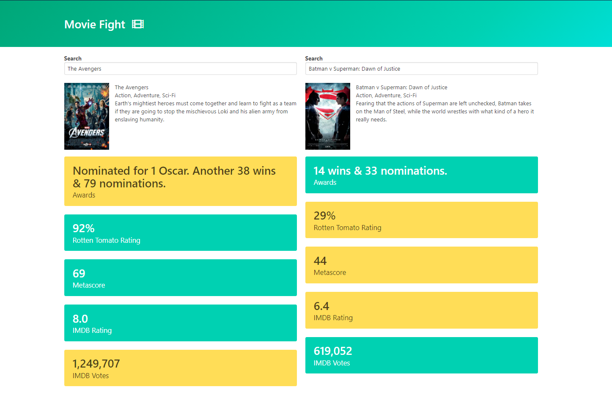
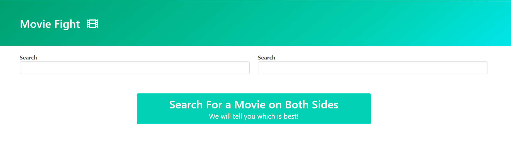

<h1 align="center">Movie Fight</h1>

<h6 align="center"><a href="www.google.com">Live Demo</a></h6>

**Description**

Movie Fight is a javascript based application thta you can use to make a fight between two of your movies.The movie which is dominating over a factor over another movie has green colur as background over that factor and other has red colour as background.

**How to Play?**

On the starting of the app the screen is going to be like this : 

Now here you have shown two input boxes waht you have to do is simply write the name of the movies that you want to have a fight in these two input boxes and all thats all.

**About the project**

Here,the autocomplete future is implemented from scratch and we are going to make a api request only after a time of 1.5sec ,if the user don't type anything in that time.

>Note : It may be possible that chrome is not allowing to make a api request , for this just go to top setting and allow insecure content there.